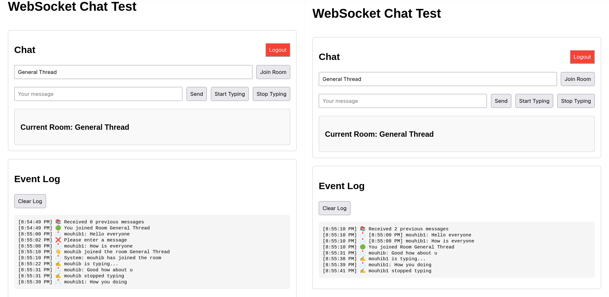

# NestJS WebSocket Chat Application

## WebSocket Test Demo

The image above shows a simple test interface for the WebSocket chat functionality. This demo allows users to:

- Login with their credentials
- Join chat rooms by name
- Send and receive real-time messages
- See typing indicators when other users are typing
- Receive notifications when other users join the room

The WebSocket implementation provides a lightweight, in-memory chat solution without database persistence.
